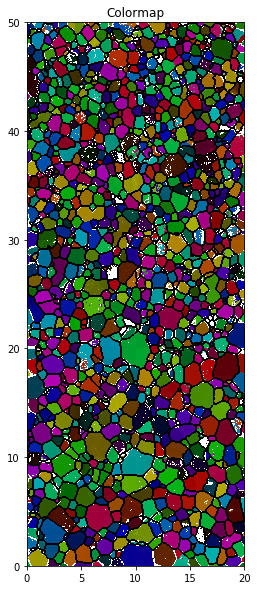
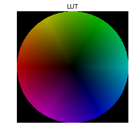
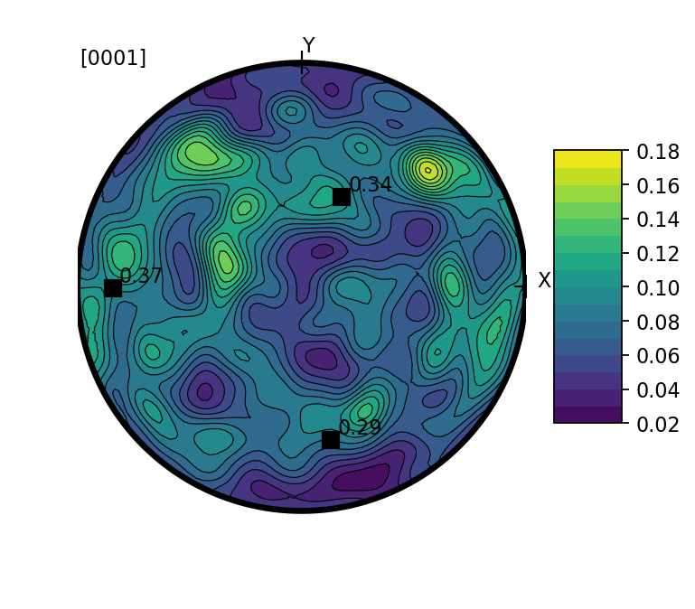
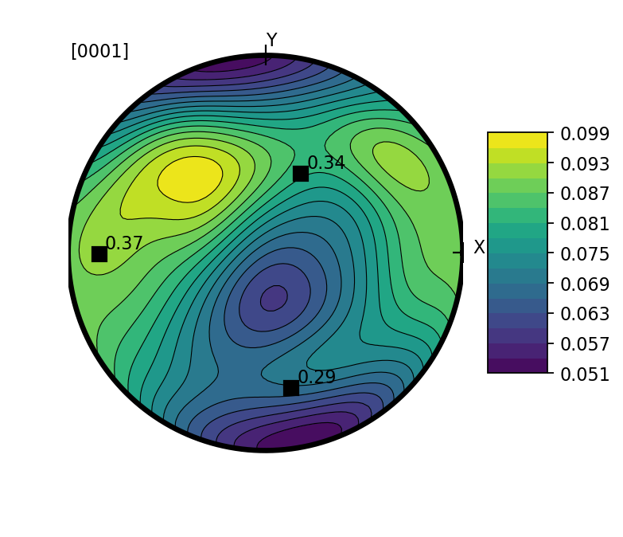
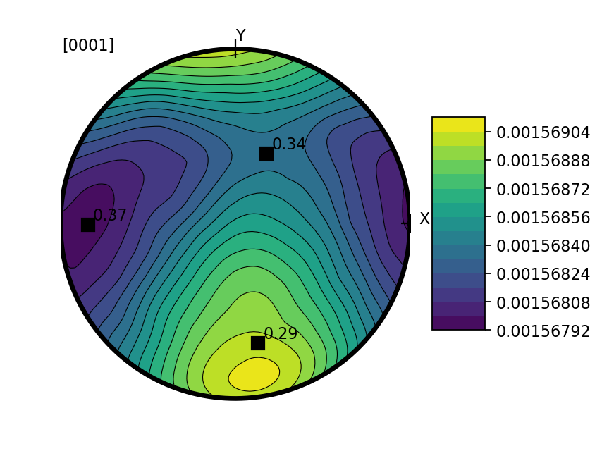
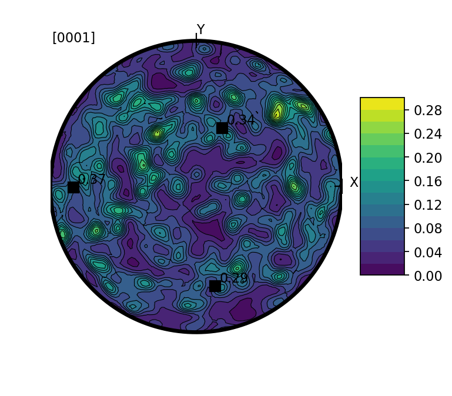
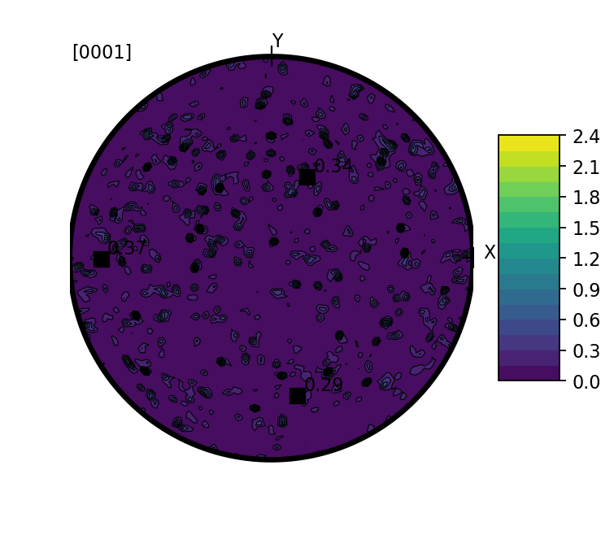
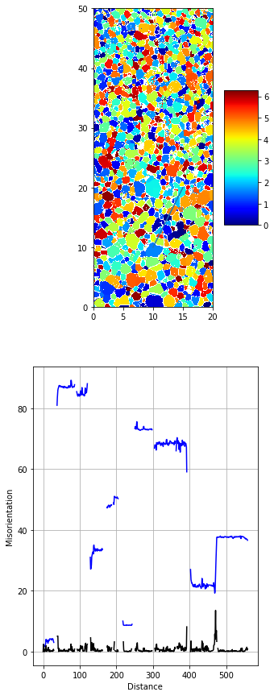

How to use aita toolbox
=======================

.. code:: ipython3

    import AITAToolbox.loadData_aita as lda
    import matplotlib.pyplot as plt

Load data from G50 analyser
---------------------------

.. code:: ipython3

    data=lda.aita5col('orientation_test.dat','micro_test.bmp')

.. parsed-literal::

    Sucessfull aita build !

Filter the data
---------------

.. code:: ipython3

    data.filter(75)

Plot a colormap
---------------

Here we plot colormap and the color wheel associated

.. code:: ipython3

    plt.figure(figsize=(10,10))
    data.plot()
    data.micro.plotBoundary(dilatation=4)
    plt.title('Colormap')

.. parsed-literal::

    Text(0.5, 1.0, 'Colormap')

.. code:: ipython3

    plt.imshow(lda.aita.lut())
    plt.axis('off')
    plt.title('LUT')

.. parsed-literal::

    Text(0.5, 1.0, 'LUT')

Plot pole figure
----------------

**Warning** The choise of the bandwidth value can be very important. It
can have a significative impact on the result. A higher value of bw will
smooth the data.

bw=0.1 (default)
~~~~~~~~~~~~~~~~

.. code:: ipython3

    plt.figure(figsize=(5,5),dpi=160)
    data.plotpdf(contourf=True,angle=0,bw=0.1)

.. parsed-literal::

    array([0.29090318, 0.36842623, 0.3406706 ], dtype=float32)

bw=0.3
~~~~~~

.. code:: ipython3

    plt.figure(figsize=(5,5),dpi=160)
    data.plotpdf(contourf=True,angle=0,bw=0.3)

.. parsed-literal::

    array([0.29090318, 0.36842623, 0.3406706 ], dtype=float32)

bw=10
~~~~~

Be careful with the colorbar. Here all the color have similar value.

.. code:: ipython3

    plt.figure(figsize=(5,5),dpi=160)
    data.plotpdf(contourf=True,angle=0,bw=10)

.. parsed-literal::

    array([0.29090318, 0.36842623, 0.3406706 ], dtype=float32)

bw=0.05
~~~~~~~

.. code:: ipython3

    plt.figure(figsize=(5,5),dpi=160)
    data.plotpdf(contourf=True,angle=0,bw=0.05)

.. parsed-literal::

    array([0.29090318, 0.36842623, 0.3406706 ], dtype=float32)

Automatic bw selection, bw=0
~~~~~~~~~~~~~~~~~~~~~~~~~~~~

It is going to test 10 value for bw between 0.01 and 1 and select the
best one. This can be time conssuming depending of you computer. It
using parallel computation. Option 'n\_jobs=-1' by default use all the
cpu. If you want to limite the cpu to n cores use 'n\_jobs=n'.

For now the range of bw and the number of value tested is limitated
(bw=np.linspace(0.01, 1., 10)). This can be change within the code or
add as option (ask me if you think it is need).

.. code:: ipython3

    plt.figure(figsize=(5,5),dpi=160)
    data.plotpdf(contourf=True,angle=0,bw=0)

.. parsed-literal::

    {'bandwidth': 0.01}

.. parsed-literal::

    array([0.29090318, 0.36842623, 0.3406706 ], dtype=float32)

Plot misorientation profil
--------------------------

.. code:: ipython3

    import numpy as np
    plt.figure(figsize=(5,15))
    [x,mis2o,mis2p,pos]=data.misorientation_profile(pos=np.array([[10,10],[15,20]]))
    plt.ylabel('Misorientation')
    plt.xlabel('Distance')

.. parsed-literal::

    Text(0.5, 0, 'Distance')

